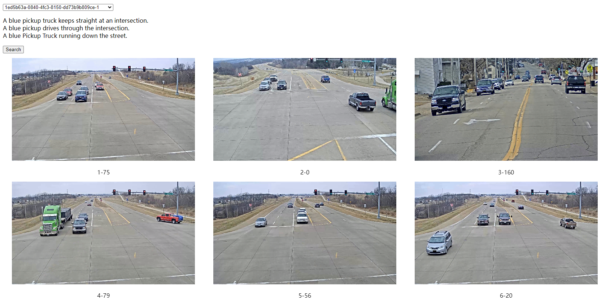

<!--
 * @Date: 2022-04-14 15:34:16
 * @LastEditors: yhxiong
 * @LastEditTime: 2022-04-14 15:59:22
 * @Description: 
-->
# AI City 2022: Connecting Language and Vision for Natural Language-Based Vehicle Retrieval
The 7nd Place Submission to AICity Challenge 2022 Natural Language-Based Vehicle Retrieval Track (Terminus-AI submission)


## Prepare
-  Preprocess the dataset to prepare `frames, motion maps, video clips`

` scripts/extract_vdo_frms.py` is a Python script that is used to extract frames.

` scripts/get_motion_maps.py` is a Python script that is used to get motion maps.

` scripts/get_clip_maps.py` is a Python script that is used to get video clips.

- data augmentation

` scripts/deal_nlpaug.py` is a Python script that is used for NLP augmentation.

` scripts/add_cnt.py` is a Python script that is used to count frequency.

- [TODO]Download the pretrained models. The checkpoints can be found [here](https://drive.google.com/drive/folders/1LAtP_CkNsM9ZDHlcr2PVmrR6f7YI-AQK?usp=sharing).

### Train
The configuration files are in `configs`.

```
CUDA_VISIBLE_DEVICES=0,1,2,3 python -u main.py --name your_experiment_name --config your_config_file 
```

For example, to train `four-stream architecture` model on a four GPU and the experimental path is ./four-stream, run:

```
CUDA_VISIBLE_DEVICES=0,1,2,3 python -u main.py --name four-stream \
--config configs/deberta_allloss_triple_ov_cnt_lang_v5_3sent_10fold_swin3d.yaml 
```

### Test
- Video Swin Transformer as Clip Encoder

Change the `RESTORE_FROM` in your configuration file.

```
python -u test.py --config your_config_file
```

- Video Encoder in VideoClip as Clip Encoder

Change the `RESTORE_FROM` in your configuration file.

```
python -u test_videoclip.py --config your_config_file --output_dir your_output_dir
```

[TODO]Extract the visual and text embeddings. The extracted embeddings can be found [here](https://drive.google.com/drive/folders/1DBVapSsw2glnJi_LxiRaIQXu3CWDfZbe?usp=sharing).


## Submission

During the inference, we average all the frame features of the target in each track as track features, the embeddings of text descriptions are also averaged as the query features. The cosine distance is used for ranking as the final result. 

- Reproduce the best submission. ALL extracted embeddings are in the folder `output`:

```
python scripts/get_submit.py
```


## visualize tool

Since we have no access to the test set, we use visualize tool to evaluate our predictions.




## Friend Links：

- https://github.com/ShuaiBai623/AIC2021-T5-CLV
